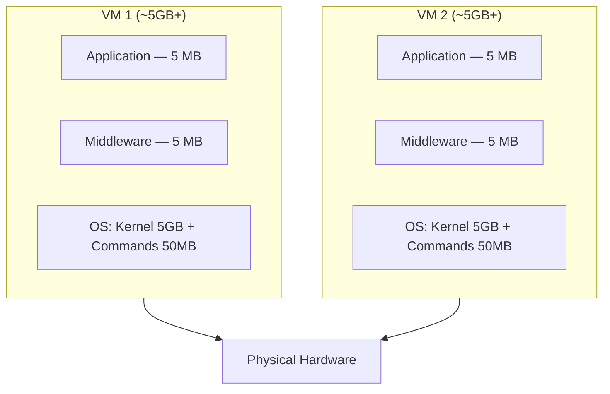
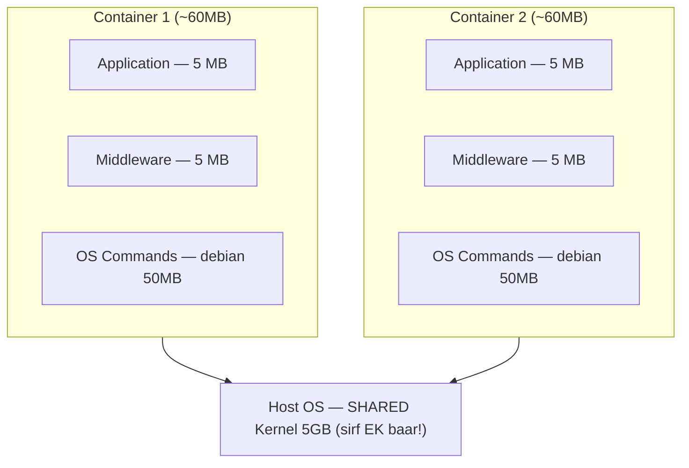
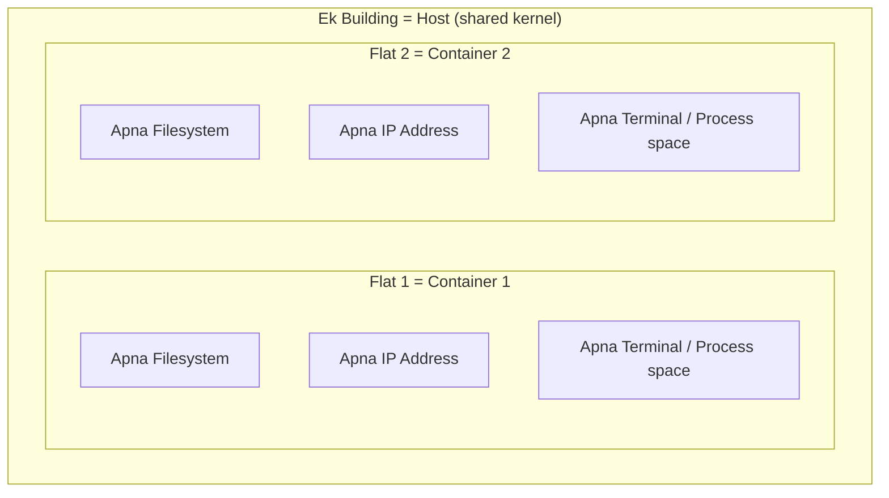
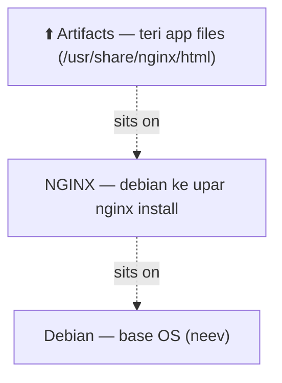
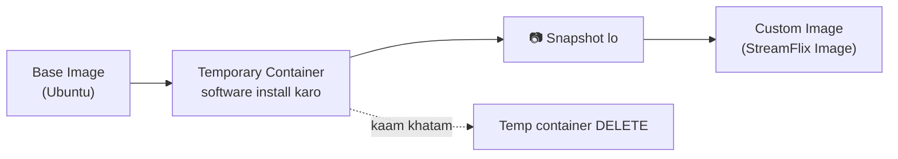

# 📦 Docker Foundations — Part 1

### Containers, Images & Isolation (basic se foundation tak)

> **Padhne ka tareeka:** Ye notes ek hi kahani ke 4 chapter hain. Upar se neeche padh — har section pichhle pe tika hai.
> **Diagrams:** Ye file GitHub pe kholne par neeche ke diagrams khud-ba-khud picture ban jaayenge (Mermaid). VS Code mein dekhna ho toh "Markdown Preview Mermaid" extension laga lena.

---

## 🎯 Ek line mein poori kahani

> Container **halka** hai kyunki wo host machine ka **kernel share** karta hai (apna alag nahi rakhta), aur namespaces se **isolated** rehta hai → uske andar **layers** ka stack hota hai (base OS → middleware → app) → wo image **base se ek temp container banake uska snapshot lene** se banti hai (concept) → par professionally hum ye kaam **Dockerfile + `docker build`** se karte hain, jahaan har layer ek auto-snapshot hai.

Bas yahi yaad rahe toh 80% Docker ki samajh aa gayi. Neeche ek-ek cheez khol ke samjhi hai.

---

## 1️⃣ Container halka kyun hai? (VM vs Container)

### 🏚️ VM ki duniya — har VM apna pura OS dhota hai



Dekho — **dono VM apna ALAG 5GB ka kernel utha rahe hain.** Wahi cheez do baar. Same OS ki copy do jagah = jagah barbaad, banana slow.

### 🏢 Container ki duniya — sab ek hi kernel share karte hain



Container apne andar **kernel rakhta hi nahi.** Sirf app + middleware + chhote se OS *commands* (debian userland, ~50MB). Kernel? Host ka ek hi kernel sab share karte hain. Isliye har container 5GB ka nahi, sirf **~60MB** ka padta hai.

### 🔑 Imprint (yahi dimaag mein chhapni chahiye)

| | VM | Container |
|---|---|---|
| **Analogy** | Alag-alag **bungalow** — har ek ki apni neev, paani ki tanki, borewell, bijli | Ek building ke **flats** — neev/paani/lift/bijli sabke common |
| **Kernel** | Har VM ka apna (duplicate) | **Host ka ek hi kernel sab share** karte hain |
| **Size** | GBs | MBs |
| **Boot** | Minutes | Seconds |

> **Punchline:** Container koi "chhota VM" nahi hai. Container = **host ke kernel pe chalne wala ek isolated process.** Kernel duplicate nahi hota, isliye halka.

---

## 2️⃣ Container isolated kaise hai?

Building share kar rahe hain — phir bhi har flat private hai. Wahi isolation hai:



- **Filesystem** → har container ko lagta hai pura file system uska apna hai. Padosi ki files dikhti hi nahi. *(apne kamre, doosre ke andar nahi jhank sakta)*
- **IP Address** → har container ka apna network address. *(apni doorbell, apna address)*
- **Terminal / Process space** → har container ke apne processes, apna shell. *(ghar ke andar ka maamla bahar nahi dikhta)*

### 🔑 Interview imprint

Ye jaadu Linux ke do features se hota hai:
- **namespaces** → *isolation*. Filesystem / network / process ko alag-alag "dikhana". (flat ka apna darwaza-address-saman)
- **cgroups** → *resource limit*. Kis container ko kitni RAM / CPU milegi. (har flat ka apna bijli-meter)

> Itna bol diya interview mein — "container = process isolated via namespaces, resource-limited via cgroups, sharing the host kernel" — toh banda impress.

---

## 3️⃣ Image ke andar kya hota hai? (Layers)

Image = ek **balti** jisme layers neeche se upar bhari hoti hain:



Iski **recipe** hoti hai **Dockerfile** (class wali drawing mein "File" box):

```dockerfile
# 1. nginx aaja debian wala  -> Debian base + nginx
FROM nginx:debian

# 2. Copy krwade artifacts /usr/share/nginx/html
COPY . /usr/share/nginx/html
```

Aur recipe ko image mein convert karne ki command:

```bash
docker build -t streamflix .
```

### 🔑 Imprint

- **Image = read-only layers ka stack.** Sabse neeche base OS, sabse upar tera code.
- **Tiffin analogy:** sabse neeche chawal (Debian) → upar dal (nginx) → sabse upar sabzi (teri artifacts). Har layer apne neeche wali pe tiki.
- **Har Dockerfile instruction = ek layer.** Isiliye `COPY requirements.txt` pehle aur `COPY . .` baad mein likhte hain → neeche ki layer cache mein reh jaaye, build fast ho. **Ye order architecture hai, preference nahi.**

---

## 4️⃣ Image banti kaise hai? (Snapshot model)



Flow: Base image lo → Docker ek **temporary container** chalata hai → tu andar software install karta hai → **📷 snapshot** leta hai → wo snapshot ban jaata hai teri **Custom Image** → original temp container **delete** ho jaata hai.

### 🔑 Sabse zaroori analogy

| Cheez | Kya hai |
|---|---|
| **Image** | 📷 **PHOTO** — freeze kiya hua snapshot, read-only, badal nahi sakti |
| **Container** | Wo **zinda scene/banda** jiski photo li — chalta-firta, badalne wala, temporary |

Tu scene set karta hai (temp container mein install), photo khinchta hai (snapshot = image), aur ab us photo se wahi exact scene **kitni bhi baar, kahin bhi** dobara bana sakta hai.

> **Game save-point analogy:** Image = save file. Container = us save se load kiya hua playthrough.

---

## 5️⃣ `docker commit` vs `docker build` (interview favourite)

Section 4 ka "container chalao → install karo → snapshot lo" wala manual tareeka = **`docker commit`**.
Section 3 ka "Dockerfile likho → `docker build`" = professional tareeka.

| | `docker commit` | `docker build` |
|---|---|---|
| **Tareeka** | Manual — haath se container badlo, phir snapshot | Declarative — Dockerfile recipe likho |
| **Reproducible?** | Nahi (kisi ko nahi pata andar kya kiya) | Haan (Dockerfile = exact recipe, version-controlled) |
| **Layers** | Ek bada snapshot | Har instruction = ek cache-able layer |
| **Real use** | Sirf concept samajhne / debugging | **MLOps / production mein yahi** |

> **Dono same cheez karte hain** (base se image banana). Bas commit manual hai, build automatic + reproducible + version-controlled.

---

## 6️⃣ Azure mapping (LinkedIn series ke liye 🔗)

| Docker concept | Azure equivalent |
|---|---|
| VM (apna kernel) | **Azure Virtual Machine** |
| Container (shared kernel) | **Azure Container Instances (ACI) / AKS pod** |
| Docker Image | **VM Image / container image in ACR** |
| Image registry | **Azure Container Registry (ACR)** |
| Dockerfile | **Dockerfile / Packer template** |
| Image size (slim/alpine) | **VM SKU sizing** |

---

## ✅ Revision checklist (interview se pehle ye bol ke dekh)

- [ ] Container halka kyun? → **host ka kernel share, apna alag nahi**
- [ ] Container VM se kaise alag? → **bungalow vs flats; VM apna OS, container shared kernel**
- [ ] Isolation kaise? → **namespaces (isolation) + cgroups (resource limit)**
- [ ] Image kya hai? → **read-only layers ka stack; PHOTO/snapshot**
- [ ] Container kya hai? → **image se chala hua zinda, writable instance**
- [ ] Image banti kaise? → **Dockerfile + `docker build`** (manual = `docker commit`)
- [ ] Layer caching kyun? → **`COPY requirements.txt` pehle, `COPY . .` baad mein**

---

*Part 1 done. Next: practical — yahi sab khud build karke aankhon se dekhna.*
