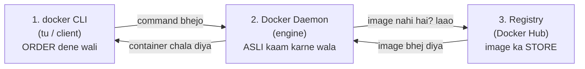
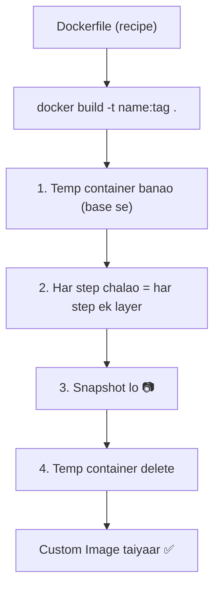
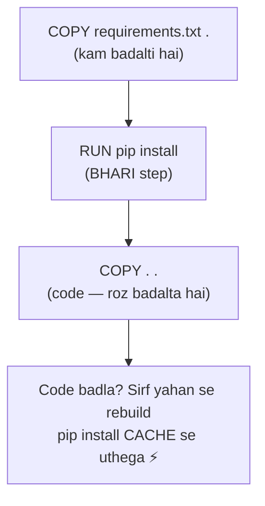

# 🚀 Docker — Part 2: Image USER se Image CREATOR tak

### Parde ke peeche kya hota hai + apni image kaise banti hai (Hinglish notes)

> **Bridge from Part 1:** Part 1 mein humne samjha image/container **hai kya** (photo vs zinda banda, layers, shared kernel). Tab tak hum sirf **USER** the — `docker run nginx` likha, doosron ki bani-banayi image chalayi.
> **Ab Part 2 mein hum CREATOR banenge** — apni khud ki image banayenge. Par usse pehle ek mast cheez: *jab tu koi docker command likhti hai, parde ke peeche actually hota kya hai?* Yahीं se Docker "click" karta hai. 🎯
> **Diagrams:** GitHub pe khulte hi neeche ke flow picture ban jaayenge (Mermaid).

---

## 🎬 Section 1 — Parde ke peeche: Docker ke 3 khiladi

Tu jab `docker run nginx` ya `docker build` likhti hai — wo command akele kaam nahi karti. **3 log milke kaam karte hain:**



| Khiladi | Kaam | Restaurant analogy 🍽️ |
|---|---|---|
| **CLI (client)** | Tera `docker ...` command — order deti hai | **Waiter** — order leta hai |
| **Daemon (engine)** | Asli kaam: image laana, container chalana | **Chef** — khaana banata hai |
| **Registry (Docker Hub)** | Images ka godown (store) | **Pantry/store** — saamaan rakha hai |

**Jab tu `docker run nginx` likhti hai, parde ke peeche:**
1. CLI (waiter) command Daemon (chef) ko deta hai
2. Daemon dekhta hai — nginx image local hai? Nahi → Registry (store) se mangwata hai
3. Image se ek container banata hai aur chala deta hai

> 🧠 **Imprint:** Tu sirf **order** deti hai (CLI). Asli kaam **Daemon** karta hai. Images **Registry** se aati hain. *Yahi teen milke "Docker" hai.*

---

## 🏗️ Section 2 — Ab CREATOR ban: `docker build` image kaise banata hai

Yaad hai Part 1 ka snapshot model? Base se temp container → install → photo → delete. Wo **haath se** karna `docker commit` tha. **`docker build` wahi 4 step KHUD karta hai — Dockerfile padh ke:**



> **Image banana = ek scene ki PHOTO khinchna.** `docker build` = wo photographer jo recipe padh ke khud sab set karta, click karta, aur cleanup kar deta hai.

---

## 📜 Section 3 — Dockerfile ka anatomy (recipe ki bhasha)

Dockerfile = chhoti si recipe file. Sabse kaam ke instructions:

```dockerfile
FROM python:3.11-slim        # base image — kis pe banao (neev)
WORKDIR /app                 # andar kaam karne ka folder set karo
COPY requirements.txt .      # pehle sirf requirements (caching ke liye!)
RUN pip install -r requirements.txt   # dependencies install karo
COPY . .                     # ab baaki sara code daalo
EXPOSE 8000                  # konsa port khulega (documentation)
CMD ["python", "app.py"]     # container start hote hi ye chalega
```

| Instruction | Kya karta hai | Yaad |
|---|---|---|
| `FROM` | base image chuno | neev rakhna |
| `WORKDIR` | working folder set | "is kamre mein kaam hoga" |
| `COPY` | files image ke andar daalo | saaman rakhna |
| `RUN` | build ke waqt command chalao | install/setup karna |
| `EXPOSE` | port batao | "is darwaze se aana" |
| `CMD` | container chalte hi default command | "shuru hote hi ye karo" |

> 🧠 **Har instruction = ek layer.** Isiliye order matter karta hai (Section 6 dekhna).

---

## ⌨️ Section 4 — Command ka anatomy (ek-ek tukda)

### `docker build -t myapp:latest .`
| Tukda | Matlab |
|---|---|
| `docker build` | recipe padh ke image banao |
| `-t myapp:latest` | image ka **naam:tag** (`-t` = tag) |
| `.` | **build context** — "isi folder se files lo" |

### `docker run -d -p 8081:80 myapp:latest`
| Tukda | Matlab |
|---|---|
| `-d` | background mein (detached) |
| `-p 8081:80` | host port **8081** → container port **80** |
| `myapp:latest` | konsi image chalani hai |

> **Build = photo banao. Run = photo se scene zinda karo.** 📷 → 🎬

---

## 🎯 Section 5 — Base image kaunsa? (slim vs alpine — MLOps rule)

`FROM` mein konsa base lo, ye bada decision hai. Teen tarah ke milte hain:

| Variant | Size | Kab |
|---|---|---|
| `python:3.11` (full) | ~1 GB | jab sab kuch chahiye, size ki parwah nahi |
| `python:3.11-slim` | ~150 MB | **MLOps ke liye best** ⭐ |
| `python:3.11-alpine` | ~50 MB | sabse chhota, **par ML mein dikkat** |

> ⚠️ **MLOps GOLDEN RULE:** ML kaam ke liye **`python:3.11-slim`** lo, alpine nahi.
> **Kyun?** Alpine `musl` libc use karta hai (normal `glibc` nahi). Numpy/pandas/torch jaisi ML libraries `glibc` maangti hain — alpine pe ye toot-ti hain ya bahut slow build hoti hain. Slim chhota bhi hai aur compatible bhi. **Best of both.**

> ⚠️ `:latest` ka trap — ye badalta rehta hai, build kabhi alag aa jaata hai. Production mein **fixed version** (`python:3.11-slim`) likho.

---

## ⚡ Section 6 — Layer caching ka jaadu (build fast kaise)

Yaad hai "har instruction = ek layer"? Docker har layer ko **cache** karta hai. Agar koi layer nahi badli, Docker use **dobara nahi banata** — sidha cache se uthata hai. Isiliye **order** matter karta hai:



**Logic:** Code roz badalta hai, requirements kabhi-kabhi. Agar `COPY . .` pehle likha → har chhote code change pe `pip install` dobara chalega (slow 🐌). Isiliye:

> **Rule:** `COPY requirements.txt` + `RUN pip install` **pehle**, `COPY . .` **baad mein.** Tab code badalne pe bhi heavy install cache se uthta hai. **Build seconds mein.** ⚡

> 🧠 Ye order **architecture** hai, preference nahi. Interview mein bahut poocha jaata hai.

---

## 🔑 Interview imprints

- Docker ke 3 khiladi? → **CLI (order), Daemon (kaam), Registry (store).**
- `docker build` kya karta? → **Dockerfile padh ke 4 step (temp → layers → snapshot → delete) automatically.**
- `commit` vs `build`? → **commit manual, build automatic + reproducible + cached.**
- Base image — alpine kyun nahi (ML)? → **musl libc, glibc ML libraries ke saath toot-ti hain → slim lo.**
- Layer caching? → **`requirements.txt` + install pehle, `COPY . .` baad mein.**
- `-t` / `.` / `-d` / `-p`? → **tag / context / background / port-map.**

---

## ✅ Revision checklist

- [ ] Docker ke 3 khiladi bol sakti hoon? (CLI, Daemon, Registry)
- [ ] `docker run nginx` pe parde ke peeche kya hota hai?
- [ ] `docker build` ke 4 internal step?
- [ ] Dockerfile ke 6 instruction (FROM, WORKDIR, COPY, RUN, EXPOSE, CMD)?
- [ ] slim vs alpine — ML ke liye kaunsa aur kyun?
- [ ] Layer caching ka order rule?

---

*Part 2 done — ab tu image CREATOR hai. 🎉 Next: PRACTICAL — apni Dockerfile likh ke khud `docker build` + `docker run` chala ke sab aankhon se dekhna.*
