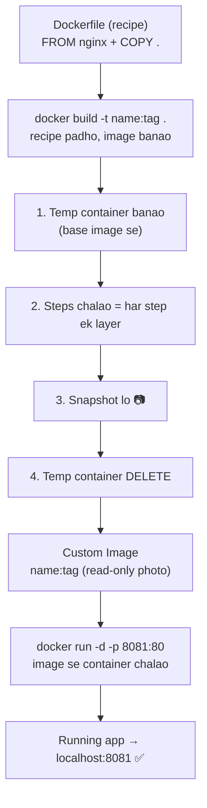
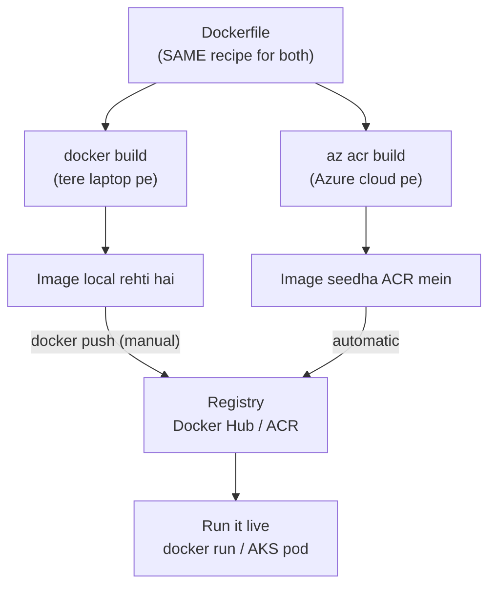

# 🏗️ Docker — Part 3: Dockerfile & `docker build`

### Recipe se image tak — tod-tod ke (Hinglish notes)

> **Padhne ka tareeka:** Ye Part 1 (foundation) ka agla kadam hai. Wahaan "image = photo/snapshot" samjha tha — ab dekhte hain wo photo banti **kaise** hai, professionally.
> **Diagrams:** GitHub pe khulte hi neeche ke flow picture ban jaayenge (Mermaid).

---

## 🎯 Ek line mein

> **`docker build` = Dockerfile (recipe) padh ke khud-ba-khud ek image bana deta hai.** Wahi "temp container → install → snapshot → delete" wala kaam jo `docker commit` mein haath se karte the — `build` automatically, har step ko ek layer bana ke kar deta hai.

> **Yaad rakh:** Image banana ≠ banana. **Image banana = ek scene ki PHOTO khinchna.** 📷

---

## 1️⃣ `docker build` andar kya karta hai? (4 step)



**Tod ke:**
1. **Temp container banao** — base image (jaise nginx) se ek throwaway container.
2. **Steps chalao** — Dockerfile ke har instruction ko run karo; **har instruction = ek layer.**
3. **Snapshot lo** — us container ki photo = teri image.
4. **Temp delete** — throwaway container hata do. Sirf image bachi.

> 🧠 Ye wahi snapshot model hai jo Part 1 mein padha. **`docker commit` = ye manual. `docker build` = ye automatic + reproducible.**

---

## 2️⃣ Dockerfile line-by-line

```dockerfile
FROM nginx:latest                  # base image kaunsa? -> nginx (debian + nginx)
COPY . /usr/share/nginx/html       # apni files nginx ke web folder mein daal
```

| Line | Kya | Yaad |
|---|---|---|
| `FROM nginx:latest` | **base image** chuno (kis pe banao) | tiffin ka sabse neeche wala dabba (neev) |
| `COPY . /usr/share/...` | apni files image ke andar daalo | upar apna saman rakhna |

> ⚠️ `:latest` ka trap — ye hamesha badalta rehta hai, build kabhi-kabhi alag aata hai. Production mein **fixed version** likho (jaise `nginx:1.27`).

---

## 3️⃣ Commands ka anatomy (ek-ek tukda)

### `docker build -t meri-custom-image:latest .`

| Tukda | Matlab |
|---|---|
| `docker build` | recipe padh ke image banao |
| `-t name:tag` | image ka **naam:tag** do (`-t` = tag) |
| `.` (dot) | **build context** — "isi current folder se files lo" |

### `docker run -d -p 8081:80 meri-custom-image:latest`

| Tukda | Matlab |
|---|---|
| `docker run` | image se zinda container chalao |
| `-d` | background mein (detached) |
| `-p 8081:80` | host ka port **8081** → container ke port **80** se jodo |
| `meri-custom-image:latest` | kaunsi image chalani hai |

> Result: browser mein `localhost:8081` → teri nginx site live. 🎉

> 🧠 **Build = photo banao. Run = photo se scene zinda karo.**

---

## 4️⃣ `docker build` vs `az acr build` (local vs cloud)

Sabse important clarity — dono ka **kaam same (image banana)**, farak sirf **kahaan banta hai**.



| | `docker build` | `az acr build` |
|---|---|---|
| Build kahaan | Tera **laptop** | **Azure cloud** |
| Image jaati kahaan | Local machine | Seedha **ACR registry** |
| Docker installed chahiye? | Haan | **Nahi** |
| Registry pe kaise | `docker push` (manual) | Automatic |

> 🍳 **Analogy:** `docker build` = ghar pe khud khaana banana (apna kitchen). `az acr build` = restaurant ko recipe bhej diya — wo **unke kitchen** mein bana ke **unke counter (registry)** pe rakh dete hain.

### ⚠️ Honest correction (ye yaad rakhna — interview gold)

> Container world mein **Azure koi alag recipe use nahi karta** — wo **same Docker ka Dockerfile** hi cloud pe chalata hai.
> Isliye *"Packer = Dockerfile"* bolna **galat** hai — Packer **VM images** banata hai (containers nahi), alag khel.
> **Sahi mapping:** `docker build` (local) ↔ `az acr build` (cloud). Same Dockerfile, alag jagah.

---

## 🔑 Interview imprints

- `docker build` kya karta? → **Dockerfile padh ke 4 step (temp → layers → snapshot → delete) automatically, image banata hai.**
- `commit` vs `build`? → **commit = manual snapshot; build = automatic, reproducible, layer-cached.**
- `-t` kya? → image ka **naam:tag**.
- `.` kya? → **build context** (current folder).
- `-p 8081:80` kya? → **host port : container port** mapping.
- `docker build` vs `az acr build`? → **same Dockerfile; ek local, ek cloud. acr build ke liye Docker bhi nahi chahiye.**

---

## ✅ Revision checklist

- [ ] Image banana = **photo khinchna** 📷
- [ ] `docker build` ke 4 internal step bol sakti hoon?
- [ ] `FROM` = base, `COPY` = files daalo
- [ ] `-t` = naam:tag, `.` = context, `-d` = background, `-p` = port map
- [ ] build (local) vs acr build (cloud) ka farak — **same recipe, alag jagah**
- [ ] `:latest` trap — production mein fixed version

---

*Part 3 done. ✅ Next: PRACTICAL — apni Dockerfile likh ke khud `docker build` + `docker run` chala ke aankhon se dekhna.*
