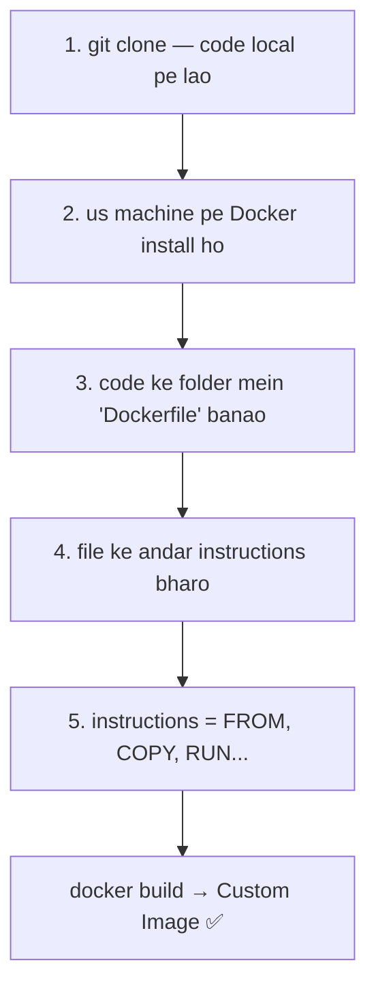
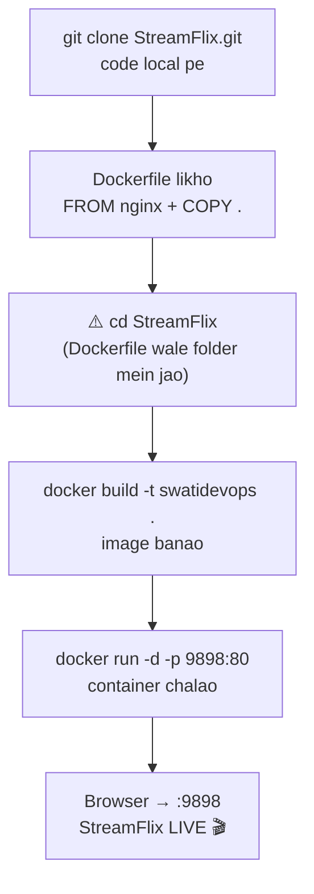

# 📜 Docker — Part 3: Dockerfile Deep Dive + Real Practical

### Saari instructions + VS Code mein clone → build → run → LIVE (Hinglish notes)

> **Bridge from Part 2:** Part 2 mein `docker build` ka concept samjha. Ab Part 3 mein Dockerfile ko **detail mein** — saari instructions — aur ek **asli practical**: ek real repo (StreamFlix) clone karke, Dockerfile likh ke, build-run karke, **browser mein Netflix-clone live** chalayenge. 🎬
> **Diagrams:** GitHub pe khulte hi neeche ke flow picture ban jaayenge (Mermaid).

---

## 🎯 Ek line mein

> **Dockerfile = instructions ki list jo `docker build` padh ke image banata hai.** File ka naam exactly **`Dockerfile`** hota hai (capital D, no extension), aur wo **code ke saath usi folder** mein rehti hai.

---

## 🧩 Custom image banane ka 5-step recipe



---

## 📜 Dockerfile ki saari instructions (grouped)

18 hain, par ghabrana mat — **rozana sirf 6-7** use hote hain.

### ⭐ Essential (90% kaam yahi)
| Instruction | Kaam |
|---|---|
| `FROM` | base image se shuruaat (neev) |
| `WORKDIR` | container ke andar working folder |
| `COPY` | files image ke andar daalo |
| `RUN` | **build ke waqt** command chalao (install/setup) |
| `EXPOSE` | konsa port khulega (documentation) |
| `CMD` | container **start hote hi** default command |

### 🔸 Important (aksar)
| Instruction | Kaam |
|---|---|
| `ENV` | environment variable set karo |
| `ARG` | build-time variable (sirf build ke waqt) |
| `ENTRYPOINT` | fixed executable (hamesha chalega) |
| `ADD` | COPY + extra (URL download, zip auto-extract) |
| `USER` | kis user se container chale |
| `VOLUME` | data persist karne ka mount point |
| `LABEL` | image pe metadata (author, version...) |

### 🔹 Advanced (rare)
`HEALTHCHECK` (health check), `ONBUILD` (jab ye image kisi aur build mein use ho), `SHELL` (default shell), `STOPSIGNAL` (stop signal), `MAINTAINER` (purana — ab `LABEL` use karo).

> 🧠 **Imprint:** `RUN` = build ke waqt chalta (image banate samay). `CMD`/`ENTRYPOINT` = container chalne pe chalta. **Build-time vs run-time ka farak yaad rakhna.**

---

## 📖 Complete A–Z reference (saari 18 instructions)

Quick lookup — jaise class slide mein thi:

| Instruction | Kya karta hai |
|---|---|
| `ADD` | local ya remote files/folders add karo (URL + zip auto-extract) |
| `ARG` | build-time variable use karo |
| `CMD` | default command specify karo (override ho sakta hai) |
| `COPY` | files aur folders copy karo |
| `ENTRYPOINT` | default executable specify karo (fixed) |
| `ENV` | environment variables set karo |
| `EXPOSE` | app kis port pe sun raha hai, batao |
| `FROM` | base image se naya build stage banao |
| `HEALTHCHECK` | container ki health check karo |
| `LABEL` | image pe metadata add karo |
| `MAINTAINER` | image ka author batao *(purana — ab `LABEL` use karo)* |
| `ONBUILD` | instructions jo tab chalein jab ye image kisi aur build mein use ho |
| `RUN` | build ke waqt command chalao |
| `SHELL` | image ka default shell set karo |
| `STOPSIGNAL` | container band karne ka system signal specify karo |
| `USER` | user aur group ID set karo |
| `VOLUME` | volume mount banao (data persist) |
| `WORKDIR` | working directory change/set karo |

---

## ⚔️ Do classic confusions (interview gold)

### `CMD` vs `ENTRYPOINT`
| | `CMD` | `ENTRYPOINT` |
|---|---|---|
| Override? | Haan, run pe badal sakte | Nahi, fixed |
| Use | default command | hamesha chalne wala main command |

> 🍕 **Analogy:** `ENTRYPOINT` = "hum sirf pizza banate hain" (fixed). `CMD` = "default margherita, par tu topping badal sakta hai" (override-able).

### `COPY` vs `ADD`
| | `COPY` | `ADD` |
|---|---|---|
| Kaam | sirf files copy | COPY + URL download + zip auto-extract |
| Kab | **default yahi** (simple, predictable) | jab sach mein URL/zip jaadu chahiye |

> 🧠 **Rule:** confusion se bachne ke liye **`COPY` use karo** jab tak `ADD` ka khaas feature na chahiye.

---

## 💻 Real Practical — VS Code mein (clone → build → run → LIVE)



### Step-by-step commands
```bash
# 1. Real repo clone karo
git clone https://github.com/devopsinsiders/StreamFlix.git

# 2. Us folder mein jao (YAHI step pe error aata hai agar bhool gaye!)
cd StreamFlix

# 3. Dockerfile banao (us folder mein), andar likho:
#    FROM nginx:latest
#    COPY . /usr/share/nginx/html

# 4. Image build karo
docker build -t swatidevops .

# 5. Container chalao (host 9898 -> container 80)
docker run -d -p 9898:80 swatidevops:latest

# 6. Chalu hai? Check
docker ps

# 7. Browser mein kholo -> localhost:9898 (ya server-ip:9898)
```

### ⚠️ Wo famous ERROR (yaad rakhna)
```
ERROR: failed to read dockerfile: open Dockerfile: no such file or directory
```
> **Kyun aaya?** `docker build .` mein wo `.` (dot) bolta hai *"isi current folder mein Dockerfile dhoondo"*. Agar tu galat folder mein hai (jaise `~/docker` jabki Dockerfile `StreamFlix` ke andar hai) → file mili nahi → error.
> **Fix:** pehle `cd StreamFlix` (Dockerfile wale folder mein jao), phir build.
> 🧠 Yaad hai Git wali seekh — *"hamesha `pwd` se folder confirm"?* **Wahi yahaan bhi.**

### Do aur chhoti baatein
- File ka naam **exactly `Dockerfile`** (capital D, no `.txt`). Warna build dhoondh nahi paata.
- `docker images` se dekho image bani; `docker ps` se dekho container chal raha.

---

## 🔑 Interview imprints

- Dockerfile ka naam? → **exactly `Dockerfile`, code ke folder mein.**
- `RUN` vs `CMD`? → **RUN = build-time; CMD = run-time (container start pe).**
- `CMD` vs `ENTRYPOINT`? → **CMD override ho sakta, ENTRYPOINT fixed.**
- `COPY` vs `ADD`? → **COPY simple; ADD mein URL/zip jaadu — default COPY.**
- `docker build .` mein `.` kya? → **build context = current folder; yahi Dockerfile dhoondta hai.**
- "Dockerfile not found" error? → **galat folder; `cd` sahi folder mein, phir build.**

---

## ✅ Revision checklist

- [ ] 5-step custom image recipe bol sakti hoon?
- [ ] Essential 6 instructions (FROM, WORKDIR, COPY, RUN, EXPOSE, CMD)?
- [ ] RUN vs CMD — build-time vs run-time?
- [ ] CMD vs ENTRYPOINT, COPY vs ADD?
- [ ] `docker build .` ka `.` kya dhoondta hai?
- [ ] "Dockerfile not found" aaye toh kya karna? (cd sahi folder)
- [ ] Pura practical: clone → cd → build → run → browser?

---

*Part 3 done — Dockerfile ab haath mein hai, aur ek real app live chala li. 🎬 Next: aur Dockerfile optimization (multi-stage builds, .dockerignore) ya Networking.*
